# V2.22-UX0 — Handoff anotado

Cada seção documenta um estado real do mockup. As imagens estão em `screenshots/`.
"Estado do lab" é o comando que reproduz a imagem (ver README → PARA REGERAR AS IMAGENS).

## START HERE — V2.22-UX1

Ordem sugerida de implementação, do mais barato ao mais arriscado:

1. **Completion: um slot por `expected_token`** (§4 abaixo). É a lacuna auditada, é só
   apresentação e destrava o resto. Payload segue `type:'text'`.
2. **Word Order: rail magnético** (§3) — `picked` + `selected`, inserção entre palavras,
   desfazer, recomeçar. Payload segue `token_sequence`.
3. **Estado "avaliando"** (§3.4) — hoje não existe estado intermediário visível entre
   Verificar e feedback; o CTA precisa dele para não permitir duplo envio.
4. **Feedback conectado pela mesma régua** (§3.5) — muda `V2FeedbackPanel`, não a semântica.
5. **Guided Writing** (§5) — modelo sob demanda e resposta preservada após avaliar.
6. **Fala com fallback escrito** (§6) — precisa de contrato (classe B). Não começar por aqui.
7. **Histórico V2-honesto** (§8) — precisa de presentation builder (classe B).

Critérios de aceite: seção H de `docs/pedagogy-v2/v2-22-ux0-interactive-exercise-design.md`.

---

## 1. Antes da atividade — categorias

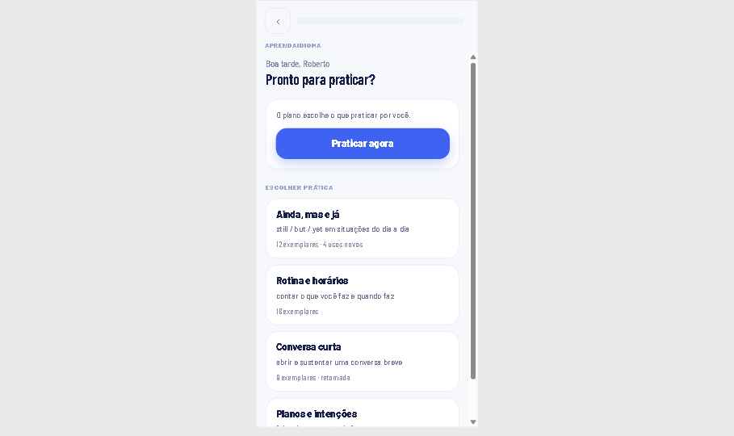

- **Componente**: `src/screens/V2LearnerHome.jsx`
- **Dados**: `buildPracticeCategoriesV2(registry)` — label e descrição vêm do manifest do pack
- **Estado do lab**: `{ screen:'categories' }`

| # | Callout | Decisão |
|---|---|---|
| 1 | Hero "Praticar agora" | permanece a ação primária: o plano escolhe por padrão |
| 2 | Cartão de categoria | `startFocused(pack_id)` → `mode:'focused'`. A categoria fixa o **pack**, nunca a frase |
| 3 | Meta factual | "12 exemplares · 4 usos novos". Contagens que já existem |
| 4 | Proibido | CEFR, % de domínio, id técnico do pack |

- **Payload**: nenhum — é navegação.
- **A11y**: cartão é um `button` de linha inteira, alvo ≥44px, descrição no mesmo nome acessível.
- **Mobile**: em 320px a meta quebra para a segunda linha; nada é truncado com reticências.

## 2. Ouvir — listening_recognition

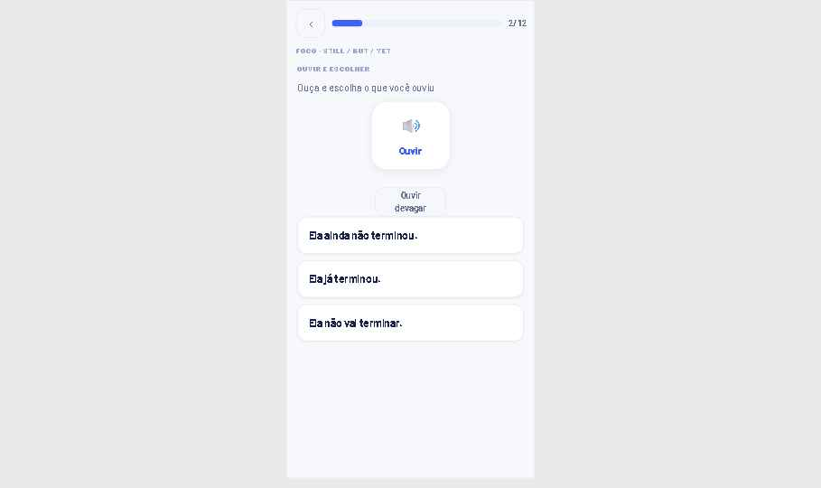
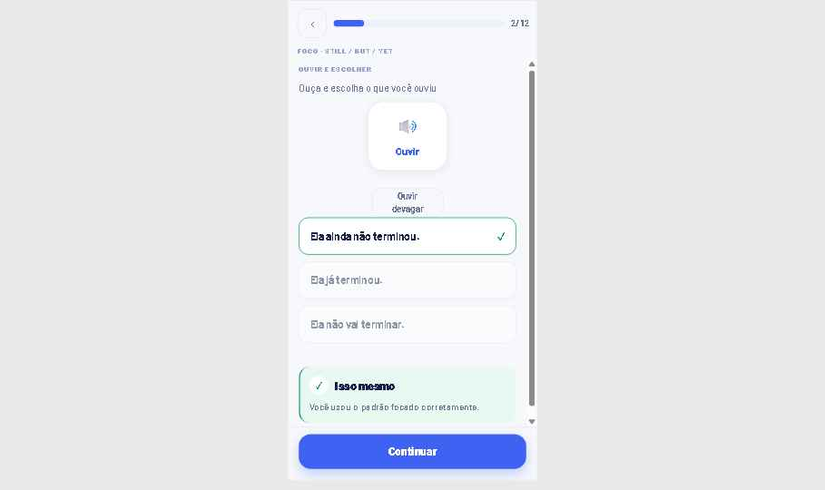

- **Componente**: `RecognitionActivity` em `V2LearnerActivity.jsx` + `V2AudioControl`
- **Estado do lab**: `{ screen:'listen' }` e `{ screen:'listen', chosen:'o1', answered:true }`

| # | Callout | Decisão |
|---|---|---|
| 1 | Nenhum texto em inglês antes da resposta | `plan.presentation.show = []`. A atividade seria trivial se o alvo estivesse na tela |
| 2 | Áudio hero | `V2AudioControl variant="hero"` → `speakSegment`; toda repetição chama `onSupport('audio_replay')` |
| 3 | "Ouvir devagar" | segunda taxa de fala do **mesmo** áudio; registra `audio_replay`, não é dado novo |
| 4 | Toque = resposta | `single_choice` avalia no toque; sem CTA concorrente na tela |
| 5 | Sem waveform | nenhuma waveform decorativa: o estado de reprodução é textual + ícone |

- **Payload**: `{ type:'single_choice', payload:{ option_id } }` — inalterado.
- **Motion**: opção escolhida ganha borda; feedback sobe na mesma coluna.
- **Reduced motion**: sem rise; a borda e o glifo (✓ / ✕) já carregam o estado.
- **A11y**: resultado nunca só por cor — glifo + borda + nome acessível ("correta" / "sua escolha").

## 3. Word Order — Opção A recomendada (Magnetic Rail)

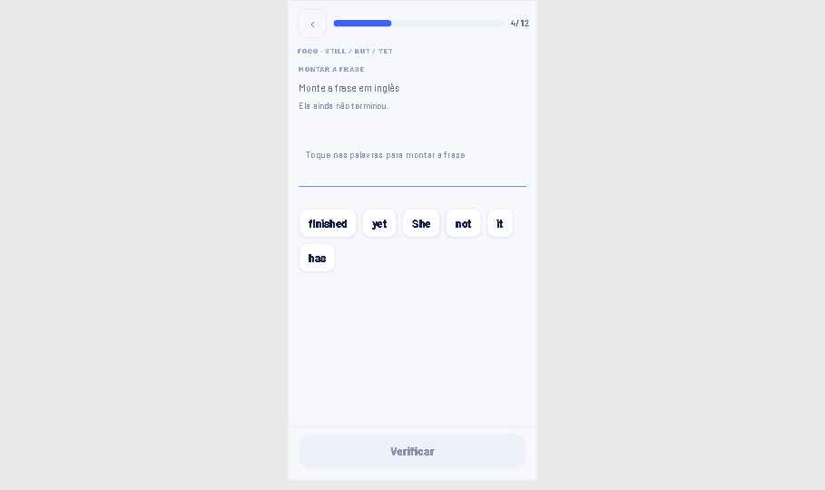
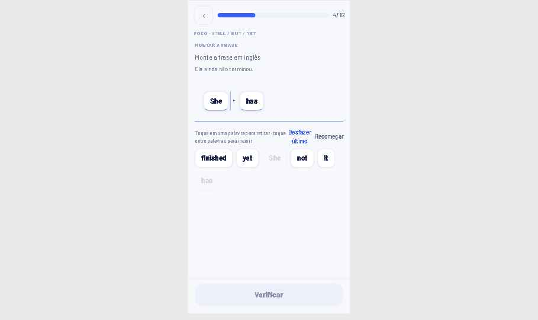
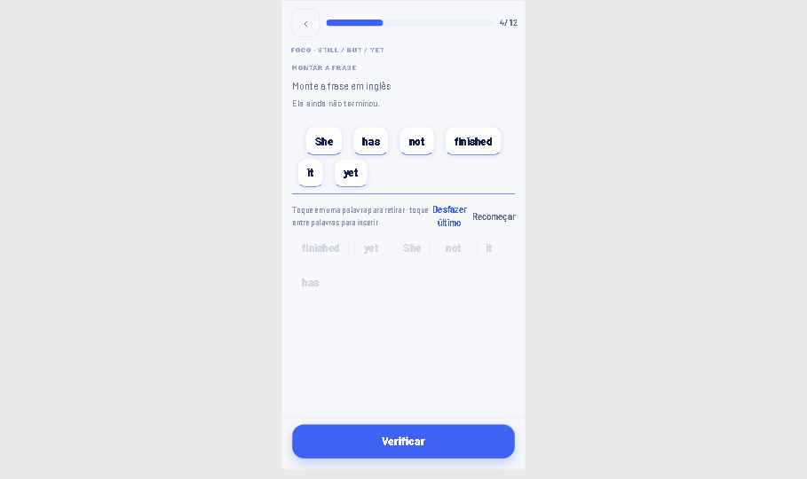

- **Componente**: `WordOrderActivity` em `V2LearnerActivity.jsx` (bloco `.v2lx-build`)
- **Dados**: `presentedOrderTokens(plan)` — ordem do plano, nunca re-embaralhada no cliente
- **Estado do lab**: `{ screen:'wo_a' }`, `{ screen:'wo_a', picked:[2,5], selected:1 }`, `{ screen:'wo_a', picked:[2,5,3,0,4,1] }`

| # | Callout | Decisão |
|---|---|---|
| 1 | Régua (borda inferior accent) | a área construída é **uma frase em formação**, não uma caixa de botões |
| 2 | Gap entre palavras | é um `button` real ("Inserir na posição 3"), não um alvo invisível |
| 3 | Toque na palavra | retira o token e devolve ao banco — reversível sem penalidade |
| 4 | Desfazer / Recomeçar | só aparecem quando há tokens; nunca ocupam espaço vazio |
| 5 | Banco por opacidade | token usado cai a 0.32 e o `aria-label` diz "já usada" — não desabilita sem explicação |
| 6 | Sem marcação por token | nenhuma palavra é marcada como certa/errada: o Assessment não fornece essa granularidade |

- **Estado local proposto**: `picked: number[]` (ids de posição) + `selected: number|null` (gap alvo).
- **Payload**: `onSubmittable({ type:'token_sequence', payload:{ tokens } })` — **inalterado**.
- **Drag**: aprimoramento opcional de pointer. Tap-to-place é o caminho principal e suficiente.

### 3.4 Estado "avaliando"

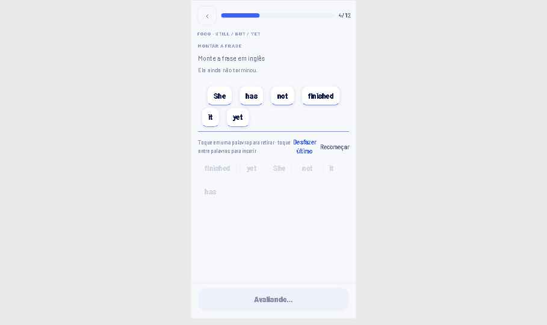

- **Estado do lab**: `{ screen:'wo_a', picked:[2,5,3,0,4,1], submitting:true }`
- A atividade permanece visível e intocada; só o CTA muda para "Avaliando…" e fica inerte.
- Existe para dar ao `V2LessonShell` um estado onde o duplo envio é impossível por construção,
  não por guarda escondida.

### 3.5 Feedback na mesma tela

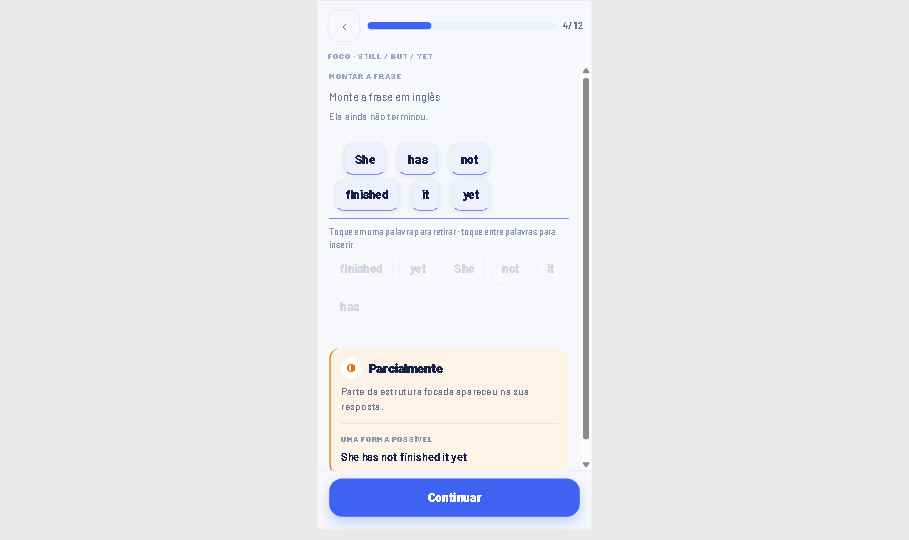

- **Estado do lab**: `{ ..., answered:true, variant:'correct' }` / `variant:'partial'`
- **Componente**: `V2FeedbackPanel.jsx`
- O feedback emerge **abaixo da resposta, na mesma coluna**, ligado por uma régua vertical
  tingida pelo tone. Sem modal, sem troca de rota, sem perder a resposta de vista.
- Tones cobertos pelo mockup: `correct`, `suggestion`, `partial`, `semantic`, `unknown`.
- `unknown` diz explicitamente que não conta como erro.
- **Motion**: resposta assenta (220ms) → feedback sobe (260ms).
- **Reduced motion**: nenhum rise; o painel aparece no lugar final.
- **A11y**: live region **apenas** no feedback; o tone tem glifo próprio além da cor.

## 3.6 Variantes descartadas de Word Order

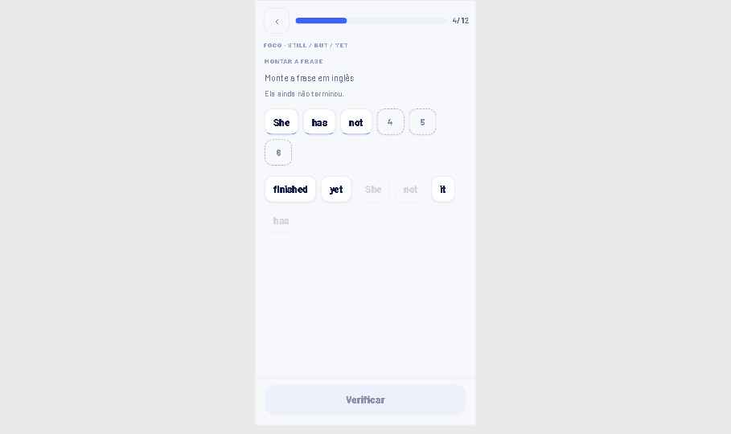
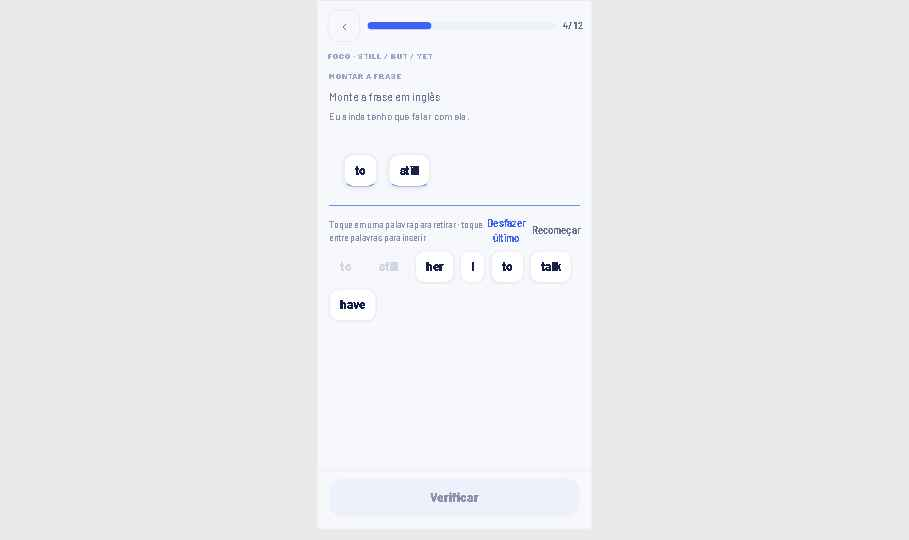

- **B — Inline Slots** (`{ screen:'wo_b', slots:{0:2,1:5,2:3} }`): N slots posicionais.
  Descartada: em 320px frases longas quebram em muitas linhas curtas e o alvo de toque
  fica menor que o token. Payload seria idêntico.
- **Palavras repetidas** (`{ screen:'wo_dup', picked:[0,1] }`): o token é identificado pelo
  **índice na ordem apresentada**, nunca pelo texto — usar um "to" não desabilita o outro.
  O `aria-label` inclui a posição para distinguir duplicatas.

## 4. Completion — a lacuna auditada

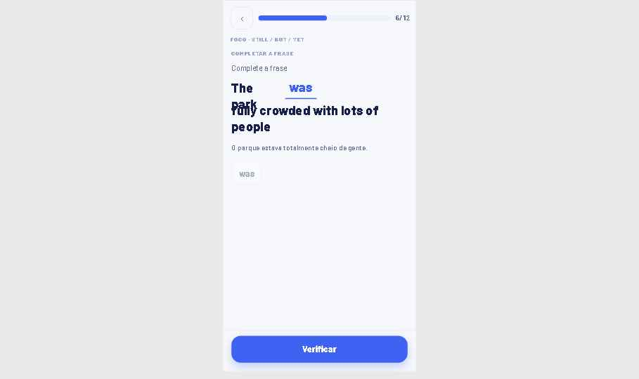
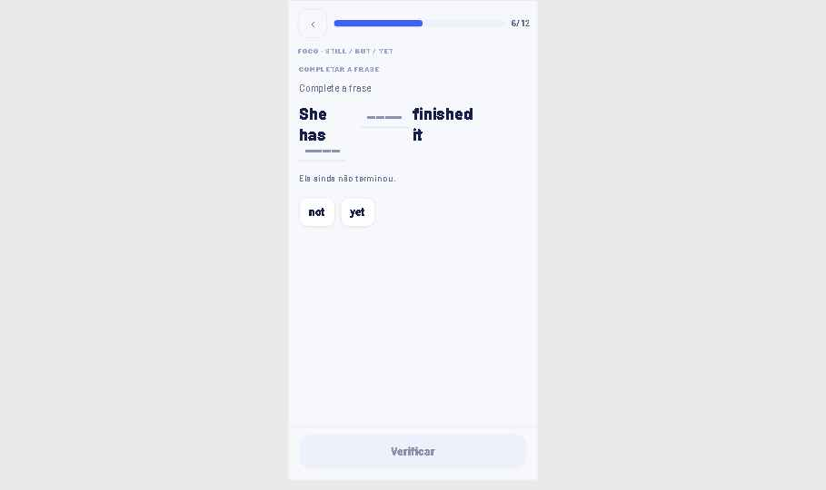
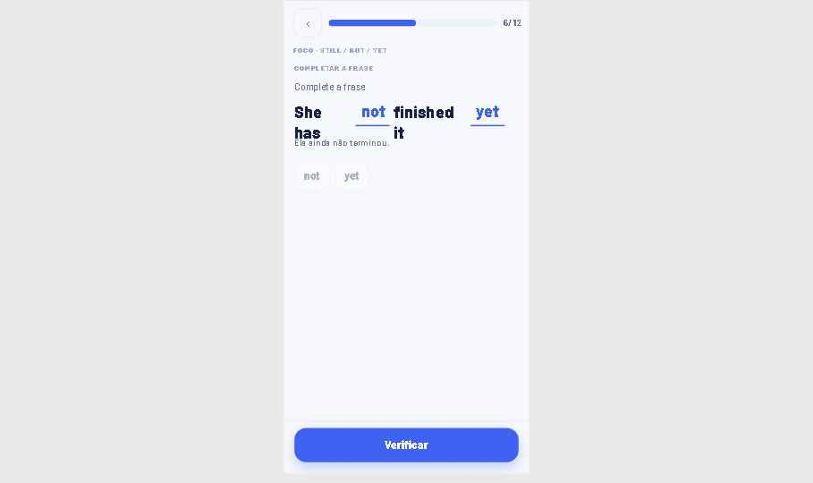
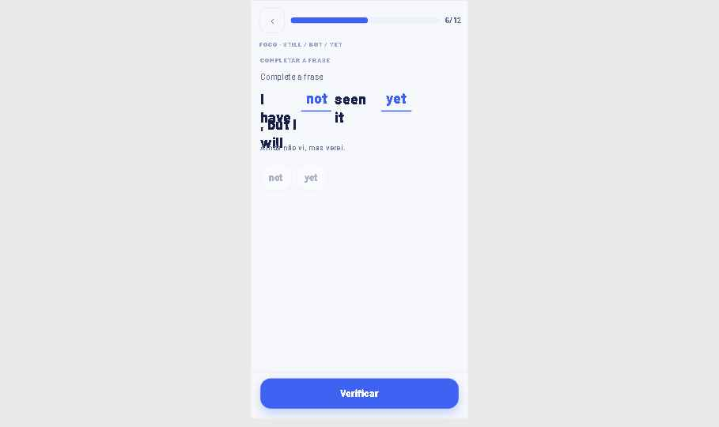
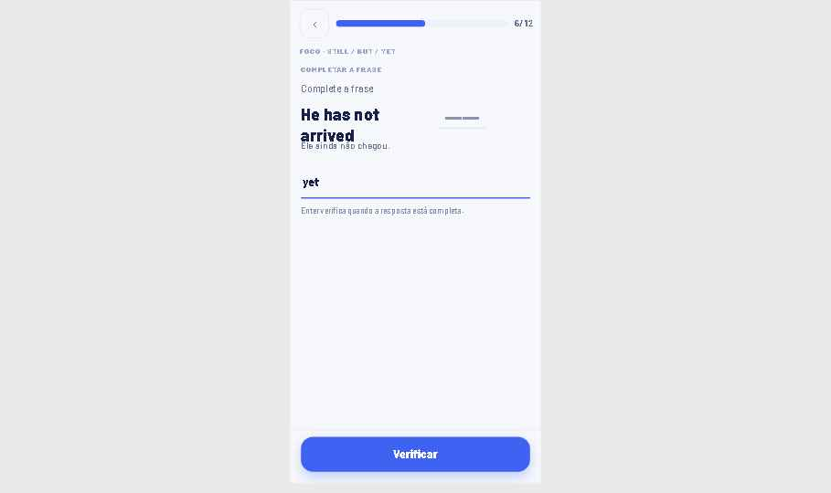

- **Componente**: `CompletionActivity` (`.v2lx-slot` dentro de `V2Sentence.jsx`)
- **Dados**: `buildMaskedCompletion(plan)` → `masked_text` + `expected_tokens`
- **Estado do lab**: `{ screen:'comp_a', fills:{0:'was'} }`, `{ screen:'comp_b' }`,
  `{ screen:'comp_b', fills:{0:'not',1:'yet'} }`, `{ screen:'comp_punct', fills:{0:'not',1:'yet'} }`,
  `{ screen:'comp_input', input:'yet' }`

| # | Callout | Decisão |
|---|---|---|
| 1 | **Lacuna atual** | `buildMaskedCompletion` pode devolver mais de um `expected_token`, mas o renderer desenha **um** `.v2lx-slot` e deixa os demais gaps como `_____` literal — gaps não preenchíveis |
| 2 | **Correção proposta** | um slot por gap, cada um preenchível, indexado por `data-gap` |
| 3 | Estado | `fills: { gapIndex → token }` em vez de um único `value` |
| 4 | Reversível | tocar no slot devolve o chip ao banco e deixa aquele gap como alvo |
| 5 | Pontuação | vírgulas e pontos pertencem ao texto mascarado, nunca ao slot; slot e pontuação não se separam em quebra de linha |
| 6 | Input livre | quando o plano não traz `word_bank`: input real integrado à frase, sem `contenteditable`, sem autocompletar local, IME não interceptado |

- **Payload**: `type:'text'` com o `masked_text` reconstituído — **inalterado**.
- **Assessment**: não muda neste slice. A correção é de apresentação.
- **Mobile**: 320px validado em `screenshots/27-320px-completion-multi-gap.png`.

## 5. Guided Writing

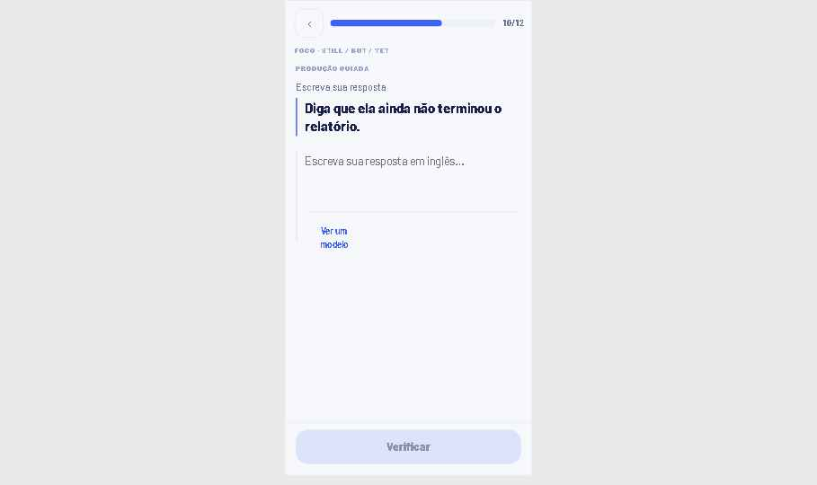
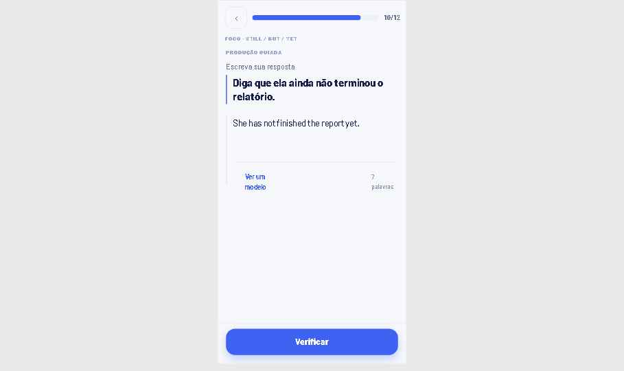
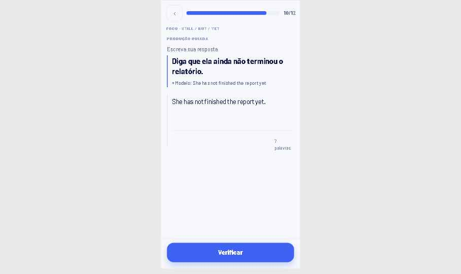
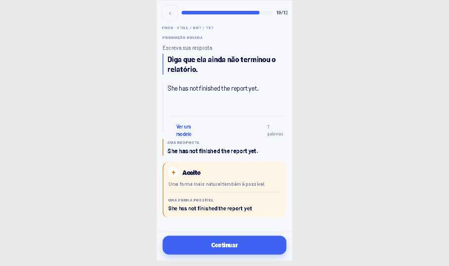

- **Componente**: `ProductionActivity` (`.v2lx-write`)
- **Estado do lab**: `{ screen:'writing' }` → `{ ..., write:'…' }` → `{ ..., modelShown:true }` → `{ ..., answered:true, variant:'suggestion' }`

| # | Callout | Decisão |
|---|---|---|
| 1 | Régua vertical | liga prompt, resposta e feedback na mesma coluna |
| 2 | "Ver um modelo" | só existe quando `plan.support.features` inclui `model_sentence`; registra `onSupport('model_sentence')` |
| 3 | Modelo é autoral | vem do plano; nada é gerado no cliente |
| 4 | Resposta preservada | após avaliar, o texto do learner continua visível acima do feedback |
| 5 | Contador de palavras | factual, sem mínimo imposto e sem alerta |

- **Payload**: `type:'text'` — inalterado.
- **A11y**: `textarea` com nome acessível próprio; o feedback não rouba foco.

## 6. Falar — com fallback escrito (classe B)

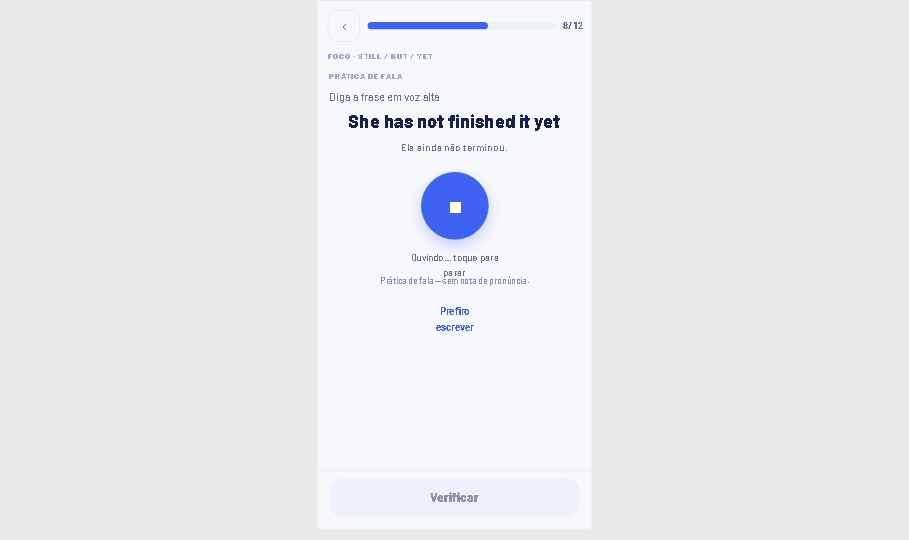
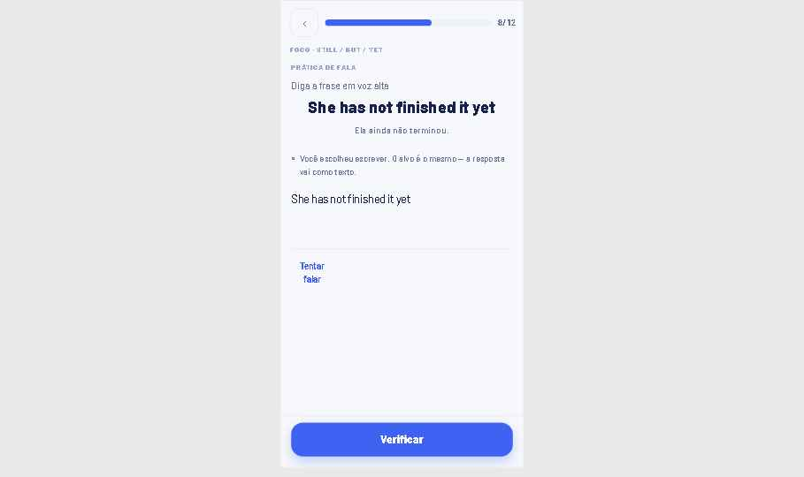

- **Componente**: `SpeakingControl` + `MicButton`, sob `capabilities.speech_input`
- **Estado do lab**: `{ screen:'speak', micState:'listening' }` e `{ screen:'speak', preferWrite:true, write:'…' }`

| # | Callout | Decisão |
|---|---|---|
| 1 | **Problema atual** | sem STT o renderer só mostra um aviso de indisponibilidade — a atividade fica sem saída |
| 2 | Proposta | "Prefiro escrever" sempre disponível, e automático quando não há STT |
| 3 | Mesmo alvo | o fallback envia `type:'text'`; o alvo linguístico não muda |
| 4 | Pronúncia | `pronunciation_attempt` é **observado**, nunca pontuado — nenhuma nota de pronúncia |
| 5 | Classe | **B**: o plano precisa declarar a modalidade alternativa no presentation contract |

- **A11y**: estado do microfone em texto ("Ouvindo… toque para parar"), nunca só por cor/animação.

## 7. Fim da sessão

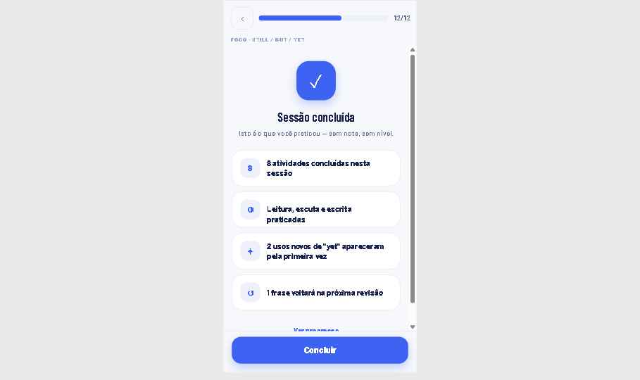

- **Componente**: `V2SessionSummary.jsx` (CompletedView)
- **Dados**: `buildLearnerSessionResultV2` → `facts[]` com `icon` + `text`
- **Estado do lab**: `{ screen:'done' }`
- Fatos, não notas: atividades concluídas, modalidades praticadas, usos novos, o que volta na revisão.
- **Proibido**: nota, %, nível, "palavra dominada".
- `kind:'empty'` mantém o shell e não finge uma sessão que não houve.
- "Ver progresso" é ação **secundária** ao lado de Concluir.

## 8. Histórico e progresso (classe B)

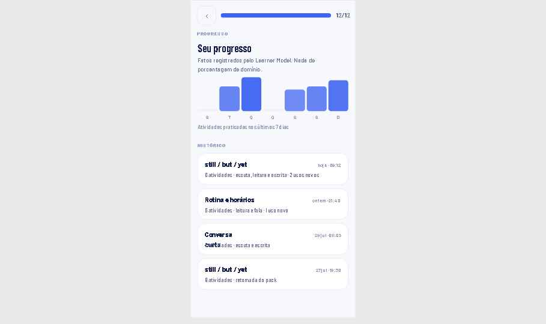

- **Componente**: `src/screens/History.jsx`
- **Estado do lab**: `{ screen:'progress' }`
- **Hoje**: a tela é V1 — `ScoreRing`, %, chips A1–B2 — incompatível com o modelo V2.
- **Proposta**: contagem de atividades por dia (dado que existe) + lista de sessões com foco,
  data, atividades, modalidades, usos novos e retomadas.
- Tocar em uma sessão inicia prática focada **no mesmo pack**.
- **Classe B**: exige um presentation builder de histórico V2. Nenhum cálculo no React.

## 9. Demo concluída

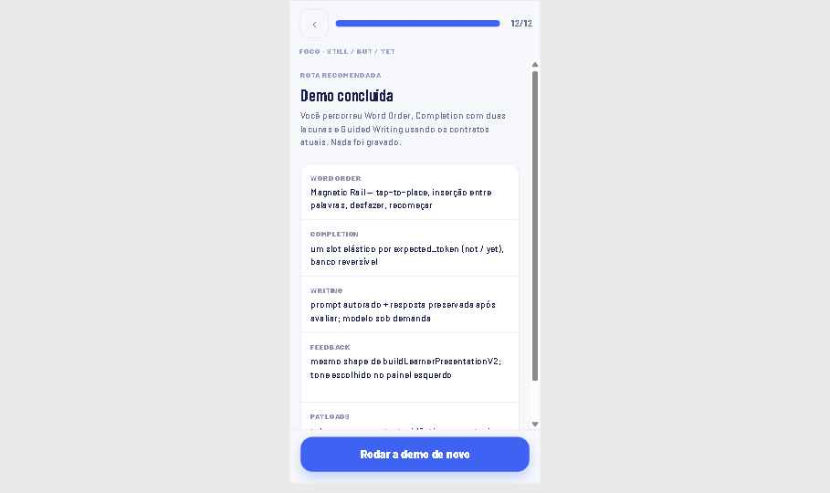

- **Estado do lab**: `{ screen:'demo' }`
- Fim da rota recomendada. Declara explicitamente o que foi percorrido e que **nada foi gravado**.
- Existe para que a demo não termine com uma tela de sucesso que finja progresso real.

## 10. Matriz de robustez

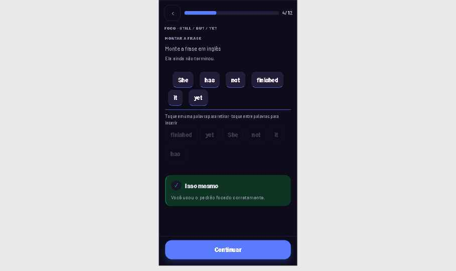
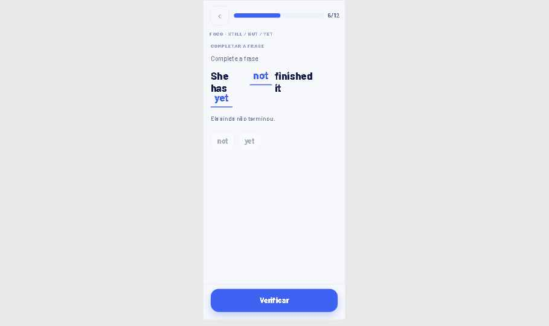
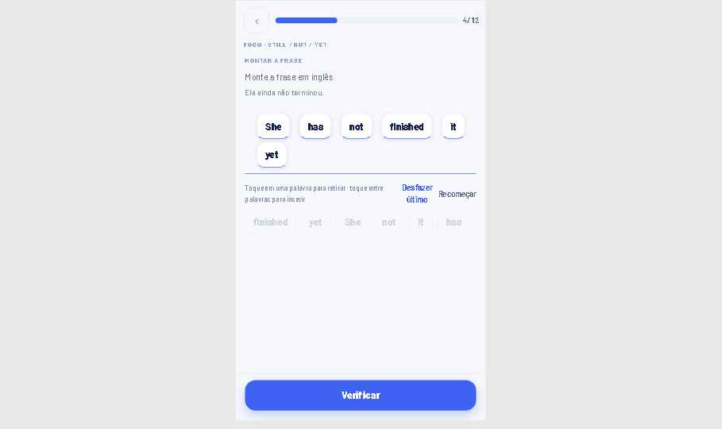
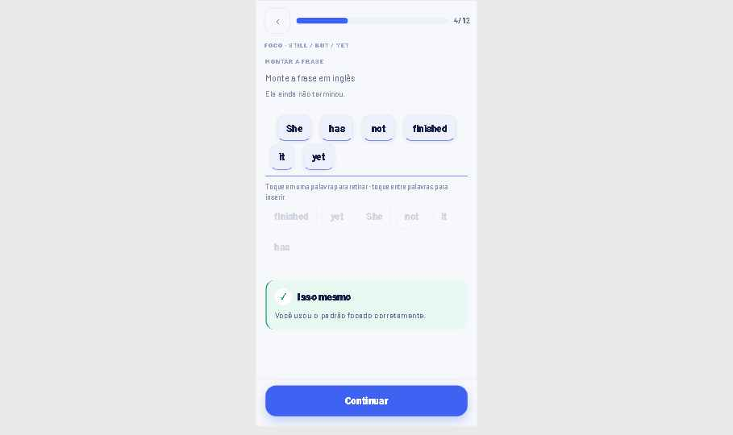

| Eixo | Imagem | Verificado |
|---|---|---|
| Dark | 26 | tones de feedback e régua legíveis; sem hex fixo |
| 320px | 27 | sem overflow horizontal; dois slots + banco cabem |
| 430px | 28 | a frase não estica além do medida de leitura |
| Reduced motion | 29 | nenhum rise, nenhum slide; estado só por borda/glifo/opacidade |
